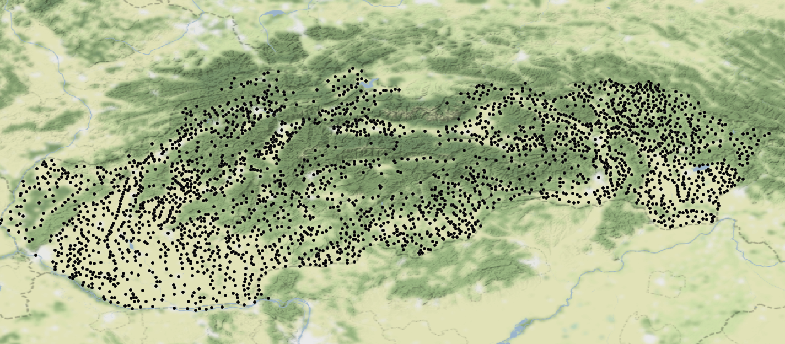

# municipalities-slovakia

GIS dataset of all municipalities in Slovakia taken from the [wikipedia page](https://sk.wikipedia.org/wiki/Zoznam_slovensk%C3%BDch_obc%C3%AD_a_vojensk%C3%BDch_obvodov).

## Attributes

Each municipality has several attributes:

- **name**
- **link** - the wikipedia link to the particular settlement, the source for all the attributes
- **region** - kraj
- **district** - okres
- **region_historical**
- **elevation**
- **area**
- **population** - year 2019
- **first_mentioned**

## Output

This dataset was exported in several formats(see ./out folder):

- .geojson
- .csv
- zipped shapefile
